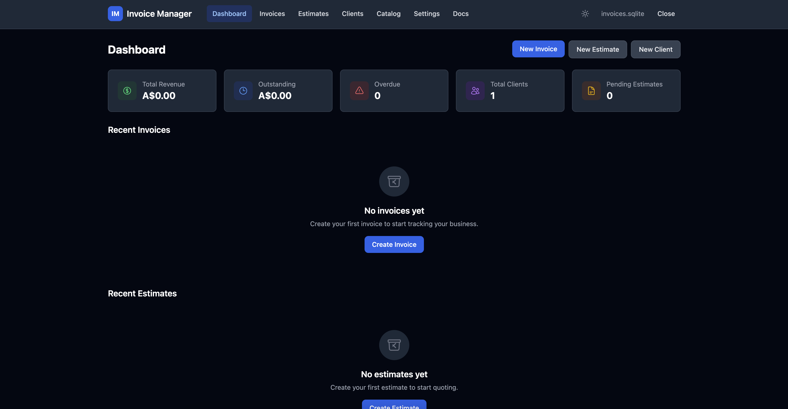

# Invoice Manager

[](https://github.com/dknathalage/invoices/actions/workflows/ci.yml)

A local-first invoice management app that runs entirely in your browser. No backend, no cloud — your data stays on your device.

Built with SvelteKit, SQLite (via WebAssembly), and Tailwind CSS. Installable as a PWA for a native-like experience on any platform.



## Features

### Invoices & Estimates
- Create, edit, and track invoices with auto-generated numbering
- Manage estimates with validity periods and convert accepted estimates directly into invoices
- Flexible line items with quantity, rate, and automatic totals
- Tax rate calculations, multi-currency support (180+ currencies), and per-document currency selection
- Add notes, track status transitions (Draft, Sent, Paid, Overdue), and perform bulk actions
- Export invoices and estimates as professional PDFs with your business logo and branding

### Clients & Catalog
- Maintain a client directory with contact details, custom metadata, and payer associations
- Product/service catalog with categories, SKUs, and units of measure
- Tiered pricing — define pricing tiers and assign tier-specific rates to catalog items and clients
- Line items auto-populate rates based on the client's assigned tier

### Import & Export
- Import data from CSV and Excel files with a guided multi-step wizard
- Smart column auto-detection, manual mapping, and a preview/diff view before committing
- Export invoices, estimates, clients, and catalog items to CSV
- Generate polished PDF invoices and estimates

### Data & Privacy
- All data stored locally in your browser using SQL.js (SQLite compiled to WebAssembly) and IndexedDB
- No server, no accounts, no tracking — completely offline-capable
- Full audit trail logging every create, update, delete, and status change
- UUID-based records with snapshot preservation of client and business info at document creation time

### PWA & Offline
- Installable on desktop and mobile as a Progressive Web App
- Service worker caches assets for offline use with automatic update prompts
- Dark mode, light mode, or follow your system preference

### Accessibility & i18n
- Keyboard navigable with ARIA labels and screen reader announcements
- Responsive layout for phone, tablet, and desktop
- Internationalization framework with full English translation and locale-aware currency/date formatting

## Getting Started

```sh
# Install dependencies
npm install

# Start the dev server
npm run dev
```

Open [http://localhost:5173](http://localhost:5173) in your browser.

## Commands

| Command             | Description                 |
| ------------------- | --------------------------- |
| `npm run dev`       | Start development server    |
| `npm run build`     | Production build            |
| `npm run preview`   | Preview production build    |
| `npm run test`      | Run tests (Vitest)          |
| `npm run check`     | Svelte type checking        |

## Tech Stack

- **Framework:** [SvelteKit](https://svelte.dev/) with Svelte 5 and TypeScript
- **Styling:** [Tailwind CSS 4](https://tailwindcss.com/) with typography plugin
- **Database:** [SQL.js](https://sql.js.org/) (SQLite via WebAssembly) with IndexedDB persistence
- **PDF:** [jsPDF](https://github.com/parallax/jsPDF) with AutoTable
- **Import/Export:** [PapaParse](https://www.papaparse.com/) (CSV) and [SheetJS](https://sheetjs.com/) (Excel)
- **PWA:** Workbox service worker, installable manifest
- **Markdown:** [mdsvex](https://mdsvex.purus.dev/) for documentation pages
- **Testing:** [Vitest](https://vitest.dev/)
- **Deploy:** GitHub Pages via GitHub Actions

## License

This project is licensed under the GNU General Public License v3.0 — see the [LICENSE](LICENSE) file for details.
