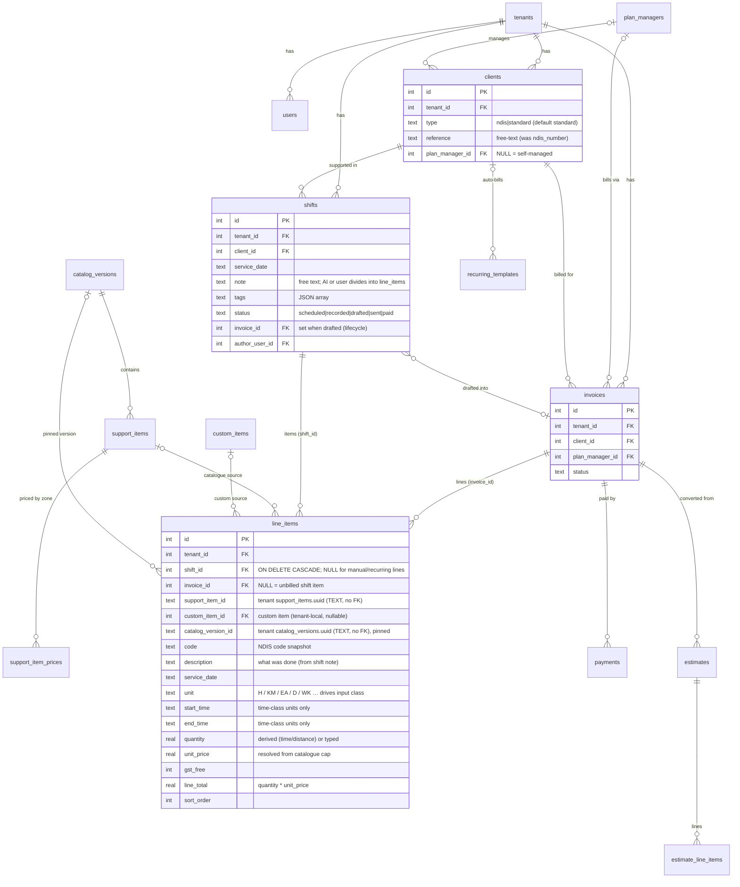

# Tallyo Data Model (ERD)

Living reference for the SQLite schema. Source of truth is the goose migrations
(`internal/db/migrations/{control,tenant}/*.sql`); this diagram is the
human-readable map. Update it whenever a migration changes a table or relationship.

> **DB-per-tenant.** Tables are split across two SQLite databases. The **control
> DB** (`control.db`) holds `tenants, users, invites, sessions` and a global
> `audit_log`. Each **tenant DB** (`tenants/tenant-<id>.db`) holds the business
> tables below — including the **tenant-owned NDIS catalogue** (`catalog_versions,
> support_items, support_item_prices`, each tenant populates its own) — plus its
> own `audit_log`. Relationships that cross the two DBs are **logical only — NOT
> foreign keys**: `tenant_id` (→ control `tenants`) and `author_user_id` /
> `user_id` (→ control `users`). Within a tenant DB, `support_item_id` /
> `catalog_version_id` reference the tenant catalogue stored as **UUID TEXT** (not
> FKs — pinned per line so old invoices never re-price). The authoritative split
> ERD is in `docs/superpowers/specs/2026-06-21-sqlite-db-per-tenant-design.md`;
> keep both in sync.

> **Active change — shift items = invoice line items.** `line_items` is the single
> home for both a shift's items and an invoice's lines. A row is born on a shift
> (`shift_id` set, `invoice_id` NULL = unbilled); drafting an invoice sets its
> `invoice_id`. The row is never copied. `shifts` no longer carries `hours`/`km`/
> `measures` — every billable quantity is a `line_items` row whose `unit` class
> (time / distance / count) drives how its quantity is captured. A
> `CHECK (shift_id IS NOT NULL OR invoice_id IS NOT NULL)` forbids orphan rows.
> See `docs/superpowers/specs/2026-06-19-shift-items-unification-design.md`.

## Conventions

- Every tenant-owned table carries a `tenant_id INTEGER` column (a redundant
  guard — the file already scopes the tenant; it is NOT a foreign key, since
  `tenants` lives in the control DB).
- `line_items` and `estimate_line_items` are near-identical shapes (invoice vs
  estimate); they are deliberately separate tables, not unified.
- The NDIS catalogue (`catalog_versions`, `support_items`, `support_item_prices`)
  is **tenant-owned** — each tenant DB holds its own copy. `line_items` and
  `estimate_line_items` reference it by **UUID TEXT** (`catalog_version_id` +
  `support_item_id`), not by FK.
- Prices are pinned per line via `catalog_version_id` + `support_item_id` (tenant
  catalogue UUIDs) plus the snapshotted `code`/`unit_price`, so an existing invoice
  is never re-priced when a newer catalogue version loads.
- Agent has **no persistent tables** (Smarts are one-shot). The `notes` table and
  all `agent_*` chat tables were dropped (migrations `00005`, `00007`).

## Tables not shown

Auth/infra and supporting tables omitted from the diagram for clarity:
`invites`, `sessions`, `business_profile`, `custom_items`, `tax_rates`,
`support_item_prices` (shown), `recurring_templates` (shown), `audit_log`.
