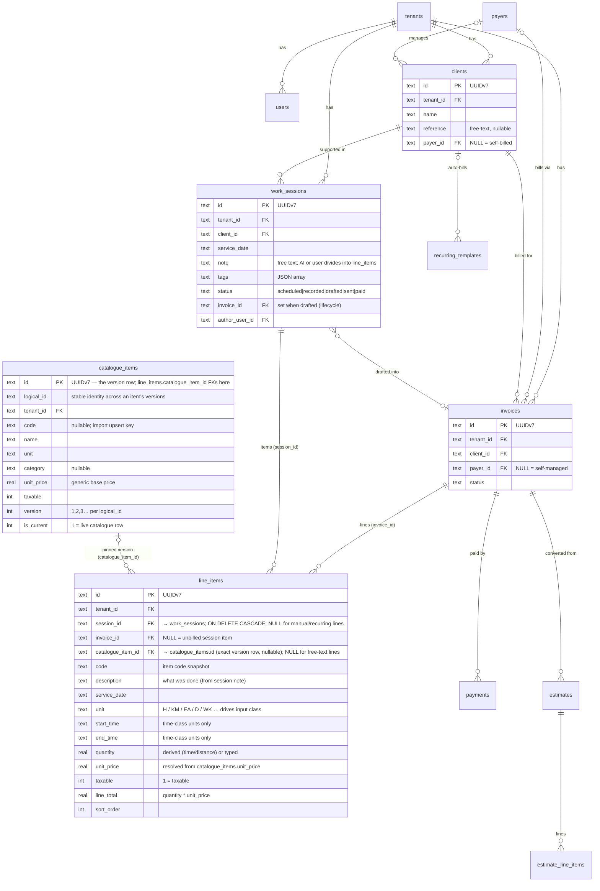

# Tallyo Data Model (ERD)

Living reference for the SQLite schema. Source of truth is the goose migrations
(`internal/db/migrations/{control,tenant}/*.sql`); this diagram is the
human-readable map. Update it whenever a migration changes a table or relationship.

> **Single SQLite file, logical tenancy.** All tables live in one file
> (`<data-dir>/tallyo.db`). Conceptually they still group into a **control** set
> (`tenants, users, invites, sessions`, a global `audit_log`) and **tenant**
> business tables below — including the **tenant-owned catalogue**
> (`catalogue_items`, each tenant populates its own) — but that split
> is logical only; there is one physical database. Tenancy is enforced by a
> `tenant_id` column on every business row plus a `WHERE tenant_id = ?` guard on
> every query. `tenant_id` (→ `tenants`) and `author_user_id` / `user_id` (→
> `users`) are **logical references — NOT foreign keys** (validated in app).
> Every id is a **UUIDv7 string** (`id TEXT PRIMARY KEY`, minted by
> `internal/ids.New()`); there is no int PK and no separate `uuid` column — the
> uuid id is used end to end. `line_items.catalogue_item_id` is a real FK to the
> exact `catalogue_items` version row a line priced from (pinned per line so old
> invoices never re-price). (The model was simplified from an earlier
> DB-per-tenant design; that historical spec lives under
> `docs/superpowers/specs/`.)

> **Session items = invoice line items.** `line_items` is the single home for both
> a work session's items and an invoice's lines. A row is born on a session
> (`session_id` set, `invoice_id` NULL = unbilled); drafting an invoice sets its
> `invoice_id`. The row is never copied. The tenant table is `work_sessions` (gen
> model `WorkSession`, mapped to domain `Session` — named `work_sessions` to avoid
> colliding with the scs `sessions` table in the same DB when sqlc merges both
> schemas); it carries no `hours`/`km`/`measures` — every billable quantity is a
> `line_items` row whose `unit` class (time / distance / count) drives how its
> quantity is captured. A `CHECK (session_id IS NOT NULL OR invoice_id IS NOT NULL)`
> forbids orphan rows.
> See `docs/superpowers/specs/2026-06-19-shift-items-unification-design.md`.

## Conventions

- Every id is a UUIDv7 string: `id TEXT PRIMARY KEY` (minted by
  `internal/ids.New()`), every FK column `TEXT` holding that uuid. No int PKs, no
  separate `uuid` column — the uuid id is the DB key, the URL segment, and the
  JSON `id`.
- Every tenant-owned table carries a `tenant_id TEXT` column — the scoping
  guard that every query filters on (`WHERE tenant_id = ?`). It is NOT a foreign
  key (validated in app).
- `line_items` and `estimate_line_items` are near-identical shapes (invoice vs
  estimate); they are deliberately separate tables, not unified.
- The catalogue (`catalogue_items`) is **tenant-owned** — scoped per tenant by
  `tenant_id` in the single DB, each tenant populating its own rows. It is one
  append-only table with **per-item copy-on-write versioning**: rows sharing a
  `logical_id` are one item's history; `is_current = 1` is the live row. Editing
  mutates the current row in place unless it is referenced by a line, in which
  case a new version row forks (old stays frozen). `category` is nullable,
  `unit_price` a generic `REAL`.
- Prices are pinned per line via a real FK `line_items.catalogue_item_id`
  (`ON DELETE SET NULL`) pointing at the exact version row, plus the snapshotted
  `code`/`unit_price`, so an existing invoice is never re-priced when the
  catalogue item is later edited (the edit forks a new version).
- The `smarts` slice has **no persistent tables** (Smarts are one-shot
  `gather → propose → apply` drafts — no chat or conversation/step state). The
  `notes` table and all `agent_*` chat tables were dropped (migrations `00005`,
  `00007`).

## Tables not shown

Auth/infra and supporting tables omitted from the diagram for clarity:
`invites`, `sessions`, `business_profile`, `tax_rates`,
`recurring_templates` (shown), `audit_log`.
