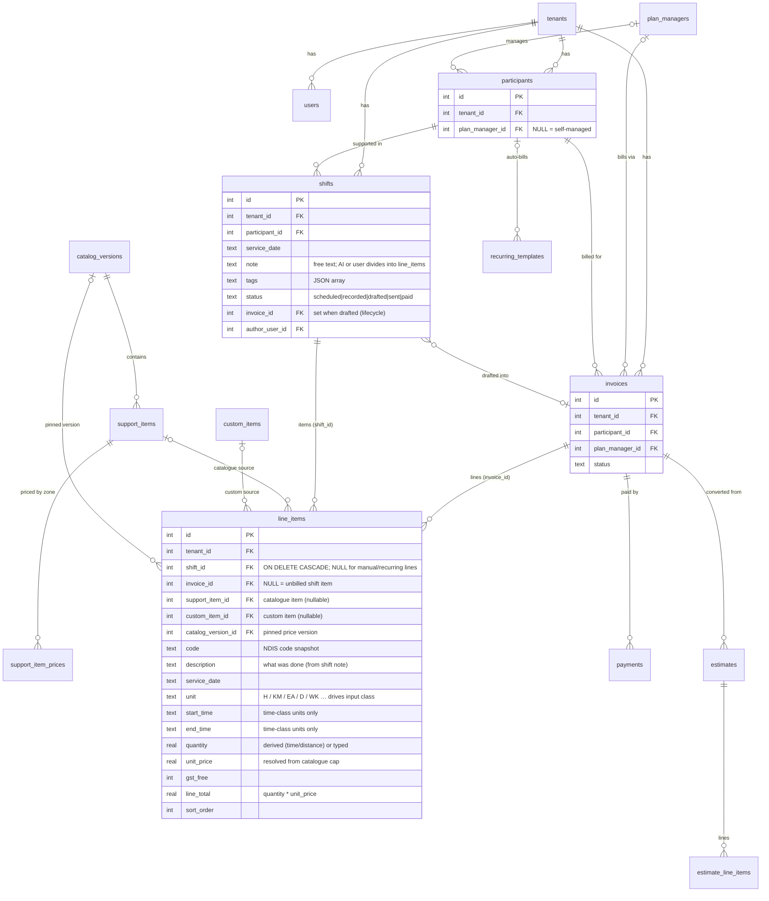

# Tallyo Data Model (ERD)

Living reference for the SQLite schema. Source of truth is the goose migrations
(`internal/db/migrations/*.sql`); this diagram is the human-readable map. Update
it whenever a migration changes a table or relationship.

> **Active change — shift items = invoice line items.** `line_items` is the single
> home for both a shift's items and an invoice's lines. A row is born on a shift
> (`shift_id` set, `invoice_id` NULL = unbilled); drafting an invoice sets its
> `invoice_id`. The row is never copied. `shifts` no longer carries `hours`/`km`/
> `measures` — every billable quantity is a `line_items` row whose `unit` class
> (time / distance / count) drives how its quantity is captured. A
> `CHECK (shift_id IS NOT NULL OR invoice_id IS NOT NULL)` forbids orphan rows.
> See `docs/superpowers/specs/2026-06-19-shift-items-unification-design.md`.

## Conventions

- Every tenant-owned table carries `tenant_id INTEGER NOT NULL REFERENCES tenants(id)`.
- `line_items` and `estimate_line_items` are near-identical shapes (invoice vs
  estimate); they are deliberately separate tables, not unified.
- Prices are pinned per line via `catalog_version_id` + `support_item_id` so an
  existing invoice is never re-priced when a newer catalogue version loads.
- Agent has **no persistent tables** (Smarts are one-shot). The `notes` table and
  all `agent_*` chat tables were dropped (migrations `00005`, `00007`).

## Tables not shown

Auth/infra and supporting tables omitted from the diagram for clarity:
`invites`, `sessions`, `business_profile`, `custom_items`, `tax_rates`,
`support_item_prices` (shown), `recurring_templates` (shown), `audit_log`.
