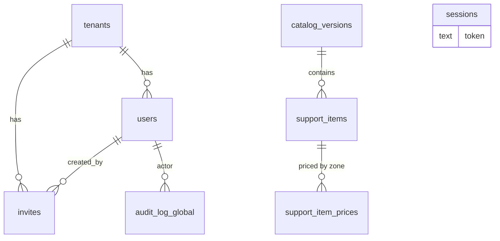
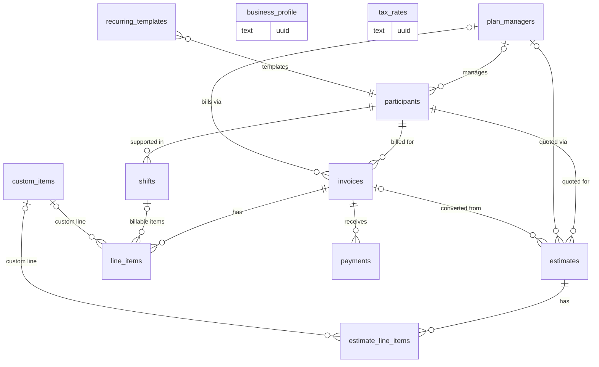

# SQLite DB per Tenant — Design

**Date:** 2026-06-21
**Status:** Approved (design), pending implementation plan

## Problem

Tallyo runs all tenants in a single shared `tallyo-go.db`. Isolation is
enforced only by a `tenant_id` column + WHERE filters on every query. We want
to move to **one SQLite file per tenant**, driven by three goals:

1. **Hard data isolation** — a tenant's rows never share a file with another;
   a query bug can't leak across tenants.
2. **Per-tenant ops** — backup, export, delete, and move a tenant as a single
   file (cheap "delete my org", trivial per-tenant restore).
3. **Scale / write contention** — single SQLite file = one writer; per-tenant
   files give parallel writers and less `busy_timeout` contention as tenant
   count grows (target: **hundreds** of tenants per deployment).

Compliance/residency is **not** a driver, so all DB files may live under one
data dir.

## Key finding that makes this clean

The current schema already supports the split with near-zero query rewrites:

- Only **two** JOINs cross any table boundary, and **both sides are control
  tables**: `users ⋈ tenants` and `support_item_prices ⋈ support_items`.
- **No query joins a tenant table against a control table.** `line_items`
  already **snapshots** `code / description / unit / unit_price` per line and
  pins `catalog_version_id`, so catalogue display needs no live join.

Therefore `sqlc`'s generated `gen` package stays a **single package** — no
split, no join rewrites. Each repo simply runs its existing queries against the
correct `*sql.DB`.

## Topology

```
data/
  control.db                 # global + shared reference data
  tenants/
    tenant-<id>.db           # one file per tenant, keyed by control-DB tenant id
```

**Registry key = the control-DB tenant `int64` id**, not the UUID. `reqctx`
already carries the tenant id (`reqctx.TenantFrom(ctx) → int64`); the UUID is
only in scope inside `httpx.ResolveTenant`. Keying by id means `ForTenant(ctx)`
needs no new context plumbing. Files are named `tenant-<id>.db`.

**control.db** (global, single file):
`tenants, users, invites, sessions, catalog_versions, support_items,
support_item_prices`, plus a small `audit_log` for global admin actions
(catalogue upload, tenant create/suspend).

**tenant-<id>.db** (one per tenant):
`business_profile, plan_managers, participants, custom_items, tax_rates,
invoices, line_items, estimates, estimate_line_items, payments,
recurring_templates, shifts, audit_log`.

Rationale for users/invites/sessions in control: login is global
(`POST /api/auth/login`, no tenant in URL) and must resolve email → tenant
before any tenant DB is known. Sessions (scs) want a single `*sql.DB`.

## Entity-relationship diagram

Mermaid can't draw a box around a group, so the two databases are shown as two
diagrams. **Solid lines = real FK constraints** (same file, enforced). The
cross-DB references between them are **logical only** — no FK constraint, listed
separately below.

### control.db



`audit_log_global` is the control-DB `audit_log` (global admin actions only —
catalogue upload, tenant create/suspend). `sessions` is the scs store, keyed by
token, unrelated to other tables.

### tenant-&lt;id&gt;.db (one per tenant)



`business_profile` (1:1 per file) and `tax_rates` stand alone within the tenant
file. `recurring_templates` also references `plan_managers`.

### Cross-DB logical references (no FK — validated in app)

| From (tenant file) | To (control.db) | Stored as |
|---|---|---|
| every tenant table `.tenant_id` | `tenants.id` | int (redundant; file already scopes) |
| `line_items` / `estimate_line_items` `.support_item_id` | `support_items` | **UUID** |
| `line_items` / `estimate_line_items` `.catalog_version_id` | `catalog_versions` | **UUID** |
| `audit_log.user_id`, `shifts.author_user_id`, … | `users` | control user id, **non-authoritative**, resolved app-side for display |

## Schema changes (minimal diff)

Tenant tables stay otherwise identical — the only change is removing FK
constraints that point at tables **not present in the tenant file** (with
`foreign_keys=ON`, such an FK errors on insert):

- `tenant_id INTEGER NOT NULL REFERENCES tenants(id)` → **plain column, FK
  dropped**. The column is kept (the file already scopes the tenant, but
  keeping the column means **zero query rewrites** — all `WHERE tenant_id = ?`
  filters still work as a belt-and-suspenders guard).
- `line_items.support_item_id REFERENCES support_items(id)` and
  `line_items.catalog_version_id REFERENCES catalog_versions(id)` → store the
  **UUID** (control-DB integer ids are meaningless across files), FK dropped,
  existence validated in app at write time. Display fields are already
  snapshotted on the line.
- `audit_log.tenant_id REFERENCES tenants(id)` **and** `audit_log.user_id
  REFERENCES users(id)` → **both FKs dropped** (neither target table exists in
  the tenant file; with `foreign_keys=ON` an audited insert would otherwise
  fail). Columns kept: `tenant_id` stays as a redundant guard; `user_id` keeps
  the control-DB user id as a **non-authoritative** display reference (resolved
  app-side from control — it is a cross-file id, not an enforced FK). The same
  applies to any tenant table with `author_user_id REFERENCES users(id)`
  (e.g. `shifts`) — drop the FK, keep the column.
- Same-DB FKs are **kept**: `invoice_id`, `estimate_id`, `custom_item_id`,
  `participant_id`, `plan_manager_id`, `shift_id`, etc. all reference
  tenant-local tables.

The `audit_log` table **shape** stays identical across both files (one sqlc
`AuditLog` model); only the FK clauses differ between the control-dir and
tenant-dir DDL — goose creates each physical copy from its own dir, so this is
fine. Carry the `idx_audit_entity` / `idx_audit_batch` indexes into the tenant
DDL (the `tenant_id` index becomes low-cardinality but is harmless).

### Integer PKs are file-local after the split

Every table keeps `INTEGER PRIMARY KEY AUTOINCREMENT`, so integer ids are only
unique **within a file** (tenant A's invoice id 1 ≠ tenant B's). This is safe
because the app already addresses tenant entities externally by **UUID** (every
tenant table has a `uuid` column; API paths use UUIDs), and same-file FKs use
local ids. Invariant to uphold in the plan: **a tenant file's local integer id
never escapes that file** (never returned as a global handle, never used
cross-file). The only integer id that crosses files is the control-DB
`tenants.id`, used solely as the registry key / file name.

## Components

### 1. Connection registry — new `internal/tenantdb`

```go
type Registry struct {
    control *sql.DB
    dataDir string
    mu      sync.Mutex
    open    map[int64]*entry // tenant id -> {db *sql.DB, lastUsed time}
}

func (r *Registry) Control() *sql.DB
func (r *Registry) ForTenant(ctx context.Context) (*sql.DB, error) // reads reqctx.TenantFrom(ctx)
func (r *Registry) ForTenantID(id int64) (*sql.DB, error)          // explicit id, for sweeps
```

- `ForTenant` reads the tenant **int64 id** via `reqctx.TenantFrom(ctx)` and
  delegates to `ForTenantID`. `ForTenantID` returns the cached handle, or on
  miss opens `tenants/tenant-<id>.db` via `db.Open`, runs lazy `goose.Up`
  **once per process** (tracked by an in-memory "migrated" set), and inserts it
  into a bounded LRU (cap ~100).
- Over cap → close the least-recently-used entry whose `lastUsed` is older than
  an **idle TTL (5 min)**; never close a handle used more recently than the TTL,
  so an in-flight request's handle is never closed mid-use. A background sweep
  (every 1 min) also closes entries idle past the TTL even when under cap.
  `// ponytail: idle handles closed; sql.DB is safe to reopen on the next hit.`
- Per-tenant pool kept small: `SetMaxOpenConns(4)` (each tenant is low-traffic;
  100 handles × 4 = 400 fds, well within limits).
- `// ponytail: LRU + idle-TTL, cap 100. For thousands of tenants add
  open-file-limit tuning + smaller pools.`

`db.Open` (existing `internal/db/sqlite.go`) is reused unchanged: same WAL +
`foreign_keys(1)` + `busy_timeout(5000)` + `_txlock=immediate` pragmas.

### 2. Migrations split

Two embedded goose dirs, each with its own `goose_db_version` table:

- `internal/db/migrations/control/*.sql` — tenants, users, invites, sessions,
  catalogue (incl. the 485 KB `00006` catalogue seed — runs once).
- `internal/db/migrations/tenant/*.sql` — the business tables.

`Migrate(control)` runs at startup. Tenant DBs migrate lazily on first open via
the registry. Each file owns its own `goose_db_version` table; the DBs are
fresh (clean-break), so relocating/renumbering the existing `00001–00008`
migrations across the two dirs is safe. The 485 KB `00006` catalogue seed moves
to `control/`.

`sqlc` is pointed at **both** schema dirs for type generation only; runtime DB
selection is the repo's job. **`audit_log` exists in both files** but its DDL is
included in the sqlc schema set **exactly once** (the table shape is identical),
so the single `gen` package has one `AuditLog` model with no collision; both the
control and tenant goose dirs still each create their own physical `audit_log`
at runtime. The plan must verify `sqlc.yaml` accepts multiple schema paths into
one output package and that no other table name is duplicated across dirs.

### 3. Repo / service DB injection (the bulk of the work)

- **Control-plane repos** (`auth.Users`, `auth.Tenants`, `auth.Invites`,
  session manager): constructed with `reg.Control()` — behaviour unchanged.
- **Tenant-plane repos** (~13): hold `*tenantdb.Registry` instead of `*sql.DB`.
  Each method begins with:
  ```go
  db, err := r.reg.ForTenant(ctx)
  if err != nil { return ... }
  ```
  then runs the existing `gen.New(db)` / `db.BeginTx(ctx)` code unchanged.
- Service constructors take `reg` instead of `conn`; bodies barely change.
- `internal/app` composition root builds one `Registry` and wires it everywhere.

### 4. Tenant provisioning (signup)

No longer a single atomic tx (it spans two files). Ordered with rollback:

1. **control tx:** insert `tenants` row + owner `users` row.
2. create + migrate `tenants/tenant-<id>.db`.
3. **tenant tx:** insert `business_profile`.

On failure at any step, unwind the prior steps (delete the tenant file, delete
the control rows). A **startup orphan-sweep** reconciles half-provisioned
tenants (tenant row with no usable file, or file with no row).

### 5. Sweeps, hub, sessions, audit

- **Sweeps** (`internal/app/sweep.go`): already per-tenant. Read
  `ActiveTenantIDs` from control, then for each id call `reg.ForTenantID(id)`
  (the explicit-id variant — the sweep runs on `context.Background()` with no
  tenant in ctx) and run the existing overdue/recurring logic against the tenant
  DB. Build the per-tenant ctx with `reqctx.WithTenant(bg, id)` as today so
  `MustTenant` inside repo methods still resolves. Only the DB source changes.
- **Realtime hub:** unchanged — global singleton, routed by `Event.TenantID`.
- **Sessions:** scs `sqlite3store` on `control.db`. Behaviour unchanged.
- **Audit:** tenant mutations write `audit_log` in the tenant DB (`audit.WithTx`
  is tx-scoped and rides the tenant tx); the tenant copy has the `tenants`/`users`
  FKs dropped (see Schema changes) so inserts succeed, and `user_id` is stored
  as a non-authoritative control reference. Global admin actions write the
  control `audit_log` (FKs intact there).

### 6. Per-tenant ops (the payoff)

- **Delete tenant:** mark control `tenants.status`, then delete
  `tenant-<id>.db` (+ `-wal`, `-shm`).
- **Export/backup:** `VACUUM INTO` (or SQLite backup API) for a consistent copy
  under WAL.
- **Move:** ship the file; the target host's `control.db` already holds the
  catalogue, so the file is self-sufficient for its business data.

## Non-goals / out of scope

- **No existing-data migration.** Clean cutover (per CLAUDE.md clean-break data
  model): the old single `tallyo-go.db` is discarded; deployments start fresh
  with `control.db` + per-tenant files. No split script.
- No sqlc package split, no query-join rewrites (see Key finding).
- No change to the realtime hub design, the auth/login flow, or the frontend.
- No compliance/residency placement features.

## Risks / decisions

- **LRU eviction vs in-flight requests:** mitigated by idle-TTL — only idle
  handles are closed. Cap (100) is generous for "hundreds of tenants".
- **Cross-file provisioning is not atomic:** mitigated by ordered rollback +
  startup orphan-sweep.
- **Dropped catalogue FK:** existence now validated in app at write time;
  display data already snapshotted on `line_items`, so read paths are
  unaffected.
- **fd usage:** 100 handles × 4 conns = ~400 fds; fine. Revisit at thousands.
- **The "no cross-boundary JOIN" finding is load-bearing.** The first plan step
  must re-verify it mechanically (`grep -niE "join (support_items|support_item_prices|catalog_versions|users|tenants)" internal/db/queries/*.sql`)
  before relying on the single-`gen`-package claim; one tenant↔control join
  would break it.

## Testing

- `tenantdb.Registry`: open/cache/evict/reopen, lazy migrate-once,
  idle-TTL-not-closing-in-flight.
- Provisioning: success path + each failure step rolls back cleanly; orphan
  sweep reconciles.
- Isolation: a tenant repo method run under tenant A's ctx never sees tenant B's
  rows (separate files).
- Sweeps: multi-tenant overdue/recurring across separate files.
- Existing per-slice repo tests re-pointed through the registry.
- Gates: `go test ./... -race`, `go vet ./...`, `gofmt -l .`,
  `CGO_ENABLED=0 go build ./cmd/tallyo`.
